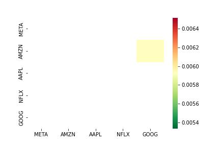
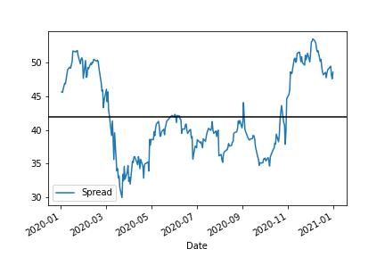
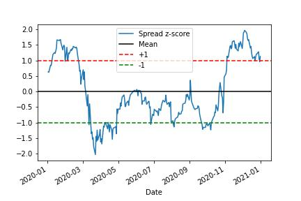
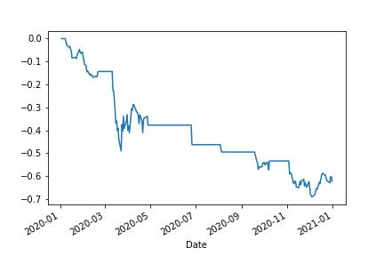

# Build a pairs trading strategy

Pairs trading (sometimes called statistical arbitrage) is a way of trading an economic relationship between two stocks. For example, two companies that manufacture a similar product with the same supply chain will be impacted by the same economic forces. Pairs trading tries to model that relationship and make money when the relationship temporarily breaks down.

Pairs trading relies on cointegration. Cointegration is a statistical method to test the stationarity between two-time series. Stationarity describes a time series that has no trend, a constant variance through time, and no seasonality. The “pair” is a linear combination of both stocks: one you buy and one you sell.

### Pairs trading exploits periodic breakdowns in economic relationships.

An ideal pairs trading scenario is when two stocks are cointegrated. In other words, there is a stable linear combination between them. The strategy will enter trades if that relationship breaks down.

The secret to pairs trading is picking the right pairs to trade. To do this, traders start with buckets of stocks that are related economically. Then they use big data sets to crunch through millions of pairs to find anomalies to exploit.

Key Takeaways:

- Get stock price data
- Find cointegrated pairs
- Model the spread
- Trade the strategy

---

Import the required libraries:

- numpy

- pandas

- statsmodels

- yfinance

- seaborn

- matplotlib

---

**File:** [Pairs Trading Strategy](PairsTradingStrategy.ipynb)

---
## Step 1: Get the data

Get the data using the yahoo finance API. 
Picking the pairs to test is the secret behind a good pairs trading strategy. For this example, use the FAANG stocks.

---

## Step 2: Find co-integrated pairs

Create a function that  loops through a list of securities and tests for cointegration between all pairs. 

It returns a cointegration test score matrix, a p-value matrix, and any pairs for which the p-value was less than 0.05.

Run the function on the stock data

**Plot the results on a heat map.**

It looks like AMZN and GOOG are co-integrated!

---

## Step 3: Model the spread

After finding a pair, run a linear regression using statsmodels and model the spread as a linear combination of GOOG and AMZN. 

b is the beta coefficient from the linear regression, otherwise known as the “hedge ratio.”

**Visualize the Spread**

---

## Step 4: Build a simple trading strategy

Buy the spread when it gets "too low" and sell the spread when it gets "too high."
But what is too low and too high? 

Use the z-score to normalize the spread and use it as the trade signal!

**Plot the Z score Spread**

If you buy the pair, you buy GOOG and sell b shares of AMZN. If you sell the pair, you sell GOOG and buy b shares of AMZN.

build a function that plots the z-score

estimate the equity curve of buying and selling the pair.

Create a DataFrame with the signal and the position in the pair. 
Add a column to the DataFrame and populate it with a 1 when the signal is less than or equal to -1 and -1 when the signal is greater than or equal to 1.

**Plot the equity curve**

As it turns out, this pair is consistently losing money!

This could mean a few things:
- There is no linear combination that is stationary and we have a false positive. 
- There is no real economic relationship that drives the two stocks.
- There is a linear combination and there is an economic relationship, but the relationship continued to break down during the frame you used.

---

### Warning:

This is a toy example and **there are some important caveats to note:**

Pairs trading assumes stock prices are cointegrated. 
Technically, that means that a linear combination of prices varies around a stable mean on the same distribution. 

In practice, traders use Augmented Dickey-Fuller tests, Hurst exponents, and Kalman filters to test for cointegration.

Looping through pairs to find p-values increases the likelihood of incorrectly finding a significant p-value when many tests are run (a false positive). 

Start with the economic rationale of why two stocks should be cointegrated. 

In practice, traders pick a handful of stocks with economic links and test those.

